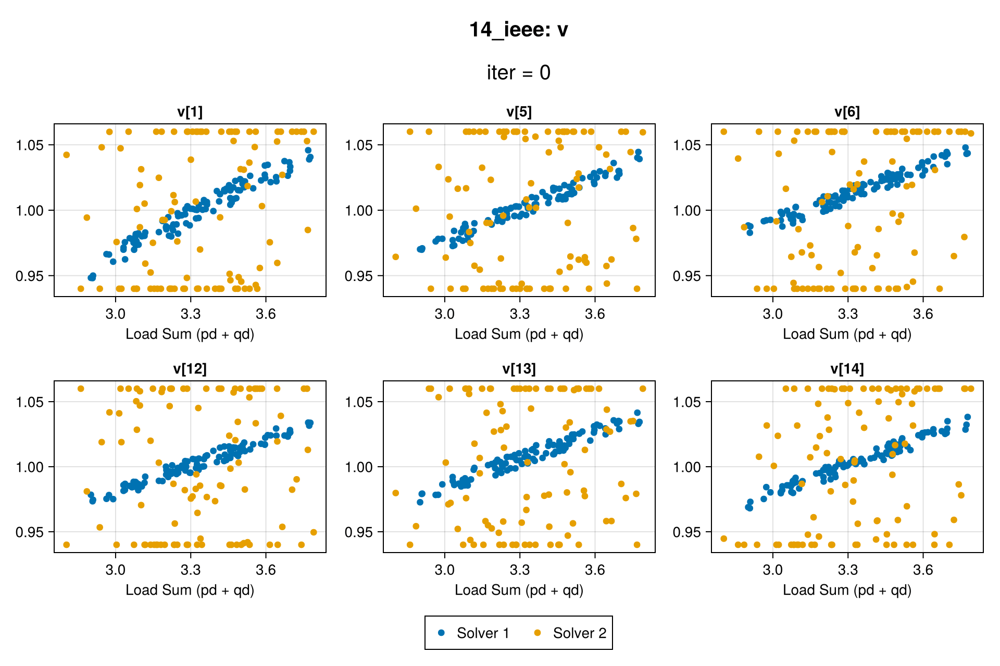
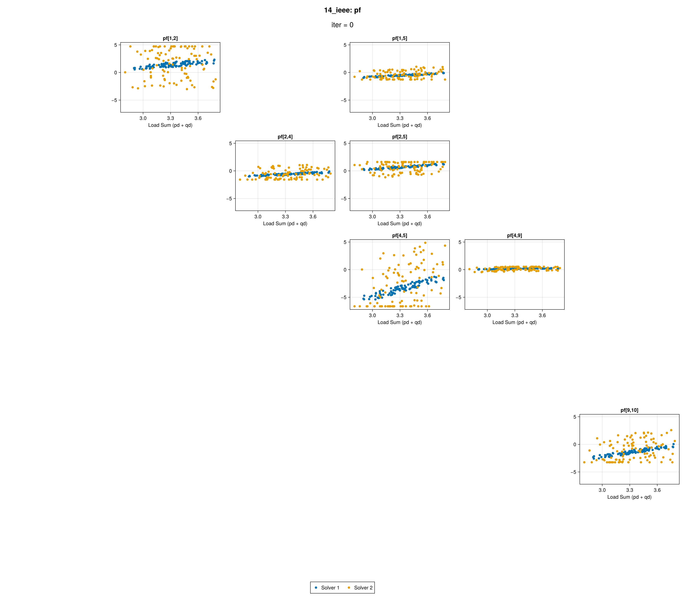

# L2OViz.jl
L2OViz.jl visualizes the solutions to multiple instances of an optimization problem.
It supports visualizing the solutions of the same instances from multiple solvers for comparison.
It also has a special feature for visualizing variables with a graph structure in a grid layout of subplots which correspond to the adjacency matrix.


## Data Format Specifications
For each variable, the values should be stored in a `Matrix` where each row contains the values of the variable in each problem instance.
For example,
```Julia
y_dim = 5
n_instances = 3
y = randn(y_dim, n_instances)
```
contains the values of a 5-dimensional variable for 3 instances of an optimization problem.

`plot_variable` accepts a variable number of `Matrix` inputs, each corresponding to a solver.

### Graph variables
Variables that correspond to the edges of a (multi-edge) undirected graph can be visualized in a grid layout of subplots which correspond to coordinates in the adjacency matrix.

The graph topology is specified by `I` and `J`, ordered vectors containing endpoints of the edges.
It is assumed that at most one of `(i,j)` and `(j,i)` is present, since the graph is undirected.
It is assumed that, across all the problem instances, the variable corresponds to the same graph topology.
The values are still stored as a `Matrix`, where the number of rows is the number of edges of the graph (dimension of the variable), and the number of columns is `n_instances`.
Each column contains the values of the variable in each problem instance.
That is, all the variables are treated as vector variables in L2OViz.jl.

In some cases the underlying graph is multi-edge.
If there are multiple edges between a vertex pair, only the highest-scoring one is kept (see [Thresholding](#thresholding)).

`plot_graph_variable` accepts a variable number of `Matrix` inputs, each corresponding to a solver.

Currently, directed graph variables are not supported.


## Visualization
The values of each variable entry across all the problem instances are visualized in a scatter point subplot.
`plot_variable` simply places the subplots side-by-side.
`plot_graph_variable` arranges the subplots into a grid layout, where the subplot at coordinate `(i, j)` visualizes the `(i, j)` entry of the variable as specified in `(I, J)`.

The data of Solver A and Solver B do not have to be for the same problem instances.
In this case, different `x` should be provided.

### Animation
`animate_variable` and `animate_graph_variable` are animated counterparts to `plot_variable` and `plot_graph_variable`.
Each frame uses the same subplot layout as its non-animated counterpart.
The animation can be exported as a GIF.


### Thresholding
When the dimension of the variable to visualize is too high, `vis_threshold` limits the number of entries that are visualized.
`significance_fn` is used to select the most interesting entries of the variable.

For graph variables, the `vis_threshold` vertices with the highest maximum scores over its edges are selected.
Only the data on this induced subgraph are visualized.

If multiple edges between a vertex pair are selected, only the highest-scoring one is kept (with a warning).

By default, `significance_fn` chooses the solutions with the maximum absolute sum across all instances of all solvers.
This can be used to, for example, visualize the variables where a solver produces highest error compared to a reference (by calling **the plotting functions on the error** instead of the solutions).


## Example: Optimal Power Flow
`exp/viz_opf.jl` defines `viz_opf` and `animate_opf`, utility functions for visualizing OPF solution data using system topology from PGLib.jl and PowerModels.jl.

`viz_opf` supports two calling modes:

- **Single variable** (`variables::String`, `var_data::Matrix...`): each `var_data` argument is a
  (n_dim × n_instances) `Matrix` of the named variable of a solver.
- **Multiple variables** (`variables::Vector{String}`, `var_data::Dict...`): each `var_data`
  argument is a `Dict` mapping variable names to matrices, one per solver. Multiple images will
  be saved.

`animate_opf` supports two similar calling modes (single- and multiple-variable). Refer to `animate_variable` and `animate_graph_variable` for the corresponding data formats.

By default (`flat=false`), the plot type is inferred from each variable's dimension:
- Equal to the number of **branches** → `plot_graph_variable`/`animate_graph_variable`, with `I`/`J` being `f_bus`/`t_bus` in **sorted branch key order** obtained from `make_basic_network(pglib(system_name))`.
- Equal to the number of **bus pairs** → `plot_graph_variable`/`animate_graph_variable`, with `I`/`J` being `f_bus`/`t_bus` in the order of their first occurences in the list of branches.
- Equal to the number of **buses** → `plot_variable`/`animate_variable`.

All the branches are assumed to be active and are accounted for.

When `flat=true`, all variables use `plot_variable`/`animate_variable`.

Output images are named `{system_name}_{variable}.png`/`{system_name}_{variable}.gif`.

### Example `viz_opf` outputs with synthetic data


### Example `animate_opf` outputs with synthetic data

