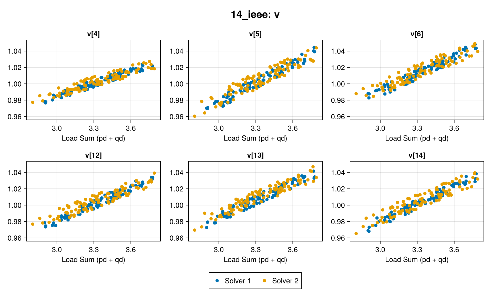
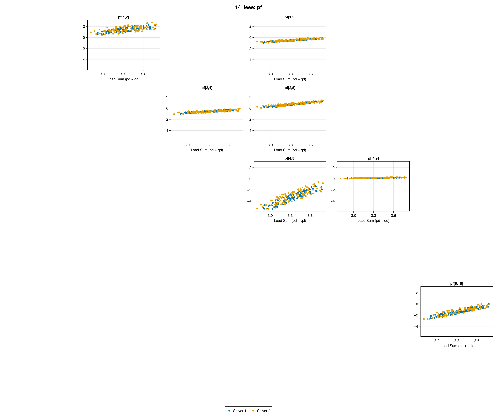

# L2OViz.jl
L2OViz.jl visualizes the solutions to multiple instances of an optimization problem.
It supports visualizing the solutions of the same instances from multiple solvers for comparison.
It also has a special feature for visualizing (the most interesting rows and columns of) symmetric matrix variables in a 2D layout of subplots which correspond to coordinates in the matrix.
This can be useful when the variables correspond to a graph for example.


## Data Format Specifications
For each variable, the values should be stored in a `Matrix` where each row contains the values of the variable in each problem instance.
For example,
```Julia
y_dim = 5
n_instances = 3
y = randn(y_dim, n_instances)
```
contains the values of a 5-dimensional variable for 3 instances of an optimization problem.

`plot_variable` accepts a variable number of `Matrix` inputs, each corresponding to a solver.

### Symmetric matrix variables
Symmetric matrix variable data should be provided in COO format.
It is assumed that, across all the problem instances, the same matrix variable has the same dimensions and sparsity structure.
The values are still stored as a `Matrix` with `n_instances` columns, where each column contains the nonzero values of the matrix variable in each problem instance.
In other words, all the variables are treated as vector variables in L2OViz.jl.

Additionally, it is assumed that the COO coordinates contain only one of each symmetry pair (i.e. a half representation; entries are visualized only at the given coordinates).

`plot_matrix_variable` accepts a variable number of `Matrix` inputs, each corresponding to a solver.


## Visualization
The values of each variable entry across all the problem instances are visualized in a scatter point subplot.
`plot_variable` simply places the subplots side-by-side.
`plot_matrix_variable` arranges the subplots into a grid layout, where the subplot at coordinate `(i, j)` visualizes the `(i, j)` entry of the variable as specified in `(I, J)`.

The data of Solver A and Solver B do not have to be for the same problem instances.
In this case, different `x` should be provided.


### Thresholding
When the dimension of the variable to visualize is too high, `vis_threshold` limits the number of entries that are visualized.
`significance_fn` is used to select the most interesting entries of the variable.


## Example: Optimal Power Flow
`exp/viz_opf.jl` defines `viz_opf`, a utility function for visualizing OPF solution data
using system topology from PGLib.jl and PowerModels.jl.

`viz_opf` supports two calling modes:

- **Single variable** (`variables::String`, `var_data::Matrix...`): each `var_data` argument is
  one solver's `(n_dim × n_instances)` matrix for the named variable.
- **Multiple variables** (`variables::Vector{String}`, `var_data::Dict...`): each `var_data`
  argument is a `Dict` mapping variable names to matrices, one per solver.

By default (`flat=false`), the plot type is inferred from each variable's dimension:
- Equal to the number of **branches** → `plot_matrix_variable`, with COO indices from `f_bus`/`t_bus` in sorted branch key order obtained from `make_basic_network(pglib(system_name))`.
- Equal to the number of **buses** → `plot_variable`.

When `flat=true`, all variables use `plot_variable`.

Output images are named `{system_name}_{variable}.png`.

### Example `viz_opf` outputs with synthetic data

